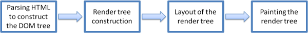
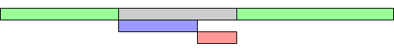
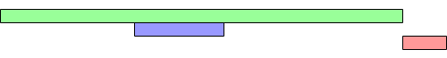

# 렌더링 동작 방식

중요도: 상
태그: 완료

# 렌더링 엔진 동작 순서

chunk 파일이 오면 렌더링 엔진은 HTML 문서를 파싱하며 DOM을 만들기 시작한다.

DOM을 만들면 CSSOM을 만들고 그 둘을 결합해 render tree를 만든다.

그 이후 어디에 DOM node를 어디에 배치할지 정하는 layout 과정이 이루어지고 그 다음 노드를 순회하며 요소를 그리는 paint 과정이 이루어진다.

# DOM

dom 구성은 점진적으로 이루어진다. HTML 응답값은 토큰으로, 토큰에서 노드로, 노드에서 dom tree로 변환된다. 노드들은 HTML 요소에 대한 모두 연관성 있는 정보를 포함하고 있다. 노드가 많을수록 순회해야 하는 수가 많기 때문에 렌더링 성능에 영향을 끼친다.

# CSSOM

DOM은 페이지의 모든 컨텐츠를 포함하고, CSSOM은 DOM을 스타일링 하기 위한 페이지의 모든 스타일 정보를 포함한다. CSSOM은 DOM과 트리를 형성하는 부분이 유사하지만 다르다. DOM의 구조는 점진적으로 증가하는 반면에 CSSOM은 그렇지 않다.

**CSS is render blocking:** 브라우저는 모든 CSS를 처리하고 수신할때까지 페이지 렌더링하지 못한다. 이유는 CSS는 규칙을 덮어쓸수 있기 때문에 렌더링을 막는다. 그러므로 CSSOM이 완료될때까지 콘텐츠를 렌더링 할 수 없다.

CSS의 C는 **cascade** 즉 계단식(종속)이다. 토큰을 노드로 변환할때 하위 노드는 부모 노드의 스타일을 상속한다. 하위노드가 부모 노드의 스타일을 덮어쓸수도 있기 때문에 HTML처럼 증감처리가 이루어지지 못하고 전부 노드가 형성될 때 까지 기다려야만 한다. `.foo` 찾을때, `.foo {}`는 `.bar .foo {}`보다 빠르다. 하지만 이는 실제론 무의미한 차이고 최적화하기엔 렌더링 엔진이 워낙 좋고 차이가 미미하기 때문에 리소스 낭비다.

# RenderTree

렌더트리는 DOM tree와 CSSOM tree를 결합하면서 컨텐츠에 스타일을 입힌다. 렌더 트리를 구성하기 위해 브라우저는 DOM 트리의 루트에서 시작하여 모든 노드를 검사하고 어떤 CSS 규칙이 첨부되어 있는지 확인한다.

렌더트리는 오로지 보여지는 요소만 측정하기 때문에 `display: none` 같은 보여지지 않는 요소는 계산되지 않는다.

# Layout

rendertree가 생성되고 나면 이제 그것들을 배치해줄 차례다. 레이아웃 단계는 요소들이 페이지에서 배치되는 위치와 방법, 각 요소의 너비와 높이 그리고 서로 관련된 위치를 결정한다. layout의 성능 DOM의 노드 개수에 영향을 받는다.

# Paint

화면에 요소를 그리는 과정이다. 첫 로드시, 전체 화면을 그리고. 그 후에는 브라우저가 필요한 최소 영역만을 다시 그리도록 최적화되어 있기 때문에 영향을 받는 영역만을 화면에 다시 그린다. 이 과정은 매우 빠르게 이루어진다.

# Tip

## [Optimizing for CRP](https://developer.mozilla.org/ko/docs/Web/Performance/Critical_rendering_path#optimizing_for_crp)

자원 로드 순서를 관리하고, 파일 사이즈를 줄이며 어떤 자원을 먼저 로드할지 정함으로써 페이지 로드 속도를 개선하세요. 성능 팁으로는 1) 자원 다운로드를 연기함으로써 중요 자원들의 수를 최소화하기 , 2) 각 요청에 대한 파일 사이즈에 따라 필수적인 요청 횟수 최적하하기, 3) 다운받을 중요 에셋의 우선순위를 정함으로써 중요 자원 불러오는 순서 최적화하고, 중요 경로 길이 최소화하기

# HTML을 파싱하다 스크립트를 만나면 어떻게 되나?

우선 기본적으로 html을 파싱하다 JS인 <script>를 만나면 DOM 트리를 변경해줄 가능성이 있기 때문에 파싱을 멈추고 스크립트 다운이 시작된다. 그래서 보통 body 태그 마지막에 스크립트 태그들을 넣어주는게 성능 최적화에 이점이 있다. stylesheet은 DOM 트리 구조를 변경하진 않기 때문에 이론적으로는 HTML 파싱을 멈추지 않는다.

보통 script 다운, 실행 사이 병목현상이 이루어지면 유저 경험이 상당히 떨어진다.(폰트 적용이 늦는다거나)

**스크립트의 로드 시점 - async, defer**

script에 async, defer속성을 사용하면 body 태그 끝자락에 넣는 것과 비슷하게 파싱 전략을 생각 할 수 있다.

## 아무 속성도 없을 때

HTML 파싱 중 스크립트를 만나면 다운, 실행 될 때 까지 파싱을 멈춘다.

## async

HTML 파싱과 병행하여 스크립트를 가져온 후 스크립트가 준비 될 때마다 즉시 실행이 가능해 진다.

따라서 스크립트가 스크립트 다운 직후 실행되므로 그전에 준비되어야 하는 스크립트가 있는 경우 사용하면 안된다.

## defer

HTML 파싱이 완전히 완료되면 스크립트 파일을 실행하도록 브라우저에 지시하게 된다.

## 그래서 둘 중 머씀?

일단 첫 번째로 스크립트 태그가 body 태그 끝자락에 있으면 사실 html 파싱은 끝났다고 봐도 무방하기 때문에 둘다 큰 의미가 없다.

그러면 이제 스크립트 파일의 의존성(종속성) 여부에 따라 둘 중 멀 쓸지 고르면 된다.

다른 스크립트에 의존성이 없는 경우엔 async가 파일이 어느 지점에서 실행되는지 정확히 알 필요가 없기 때문에 비동기 로드에 이득, 의존성을 가진 스크립트 파일이 있거나 어떤 이유에서건 파일을 다시 배치되어야 하는 경우엔 defer를 사용하면 좋다.

## 레퍼런스

[중요 렌더링 경로 - Web Performance | MDN](https://developer.mozilla.org/ko/docs/Web/Performance/Critical_rendering_path)

[브라우저의 역할과 스크립트의 로드 시점](https://webclub.tistory.com/630)

[브라우저 동작 방법 | 👨🏻‍💻 Tech Interview](https://gyoogle.dev/blog/web-knowledge/%EB%B8%8C%EB%9D%BC%EC%9A%B0%EC%A0%80%20%EB%8F%99%EC%9E%91%20%EB%B0%A9%EB%B2%95.html)

[브라우저의 동작 원리와 렌더링 최적화](https://www.huskyhoochu.com/how-browser-works/)
