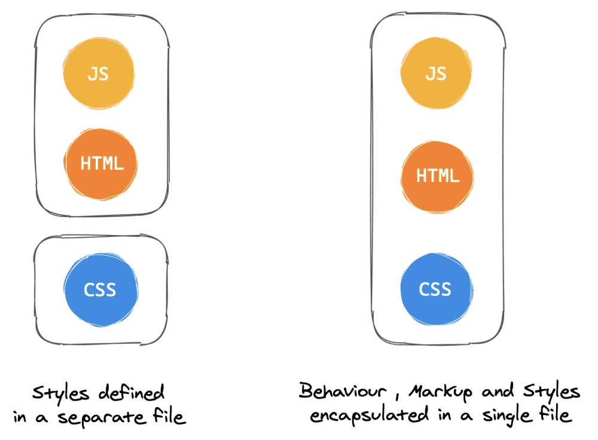
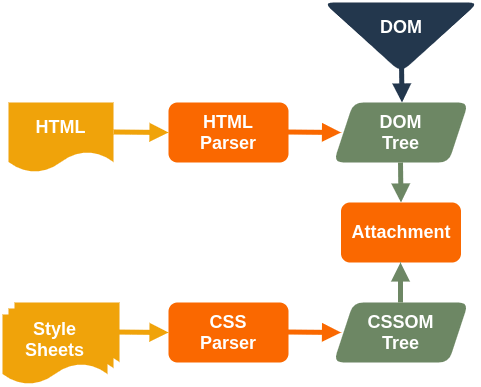

# runtime, zero-runtime CSS-in-JS(작성중...)

실개발에서 자주 사용하는 css-in-js에 대해 스스로의 정리글입니다.

<aside>
💡 다음 내용은 CSS-in-CSS입니다!

</aside>

**CSS-in-JS**는 단어 그대로 JavaScript코드에서 CSS를 작성하는 방식을 말합니다.. 2014년 페이스북 개발자인 Christopher Chedeau aka Vjeux가 처음 소개하였습니다. 기존 CSS관리의 어려움을 해결한 Facebook의 사례를 소개하고 있고 이 발표 이후 개념이 발전하면서 많은 라이브러리가 등장했습니다. 또한 최근 컴포넌트 기반 스타일링이 대중화되면서 CSS-in-JS의 사용이 증가했습니다.

여러분들은 css-in-js의 어떤 점이 마음에 들어서 사용하고 계신가요? 장점으로는

- CSS의 컴포넌트화로 스타일시트의 파일을 유지보수 할 필요가 없다. CSS 모델을 문서 레벨이 아닌 컴포넌트 레벨로 추상화할 수 있습니다. (모듈성)
- 중복되지 않는 class 이름을 고려할 필요가 없습니다.
- DOM에 대한 부하 감소: 동일한 컴포넌트안에 css를 정의하기 때문에 컴포넌트가 로드 될때 css 또한 로드 된다. 따라서 가상 돔에 대한 불필요한 연산을 줄입니다.
- CSS에서 더 나은 오류 처리: CSS도 컴파일 과정을 거치므로 오류 메시지가 표시되므로 CSS 내에서 쉽게 버그를 찾고 해결할 수 있습니다.
- Portability: 같은 프로젝트내에서 재사용하기 간편합니다.

등 이 있는 것 같습니다.

## Runtime

또한 css-in-js 나오기 이전에 **동적으로 변경되는 스타일은 정의하기 까다로웠던 부분 즉** JavaScript 코드로 제어하는 동적인 스타일링을 runtime 개념을 도입하여 해결했습니다.

대표적으로 [styled-components](https://styled-components.com/), [emotion](https://emotion.sh/docs/introduction) 등이 있습니다. prop가 변할 때마다 스타일을 **동적으로 생성**
하여 JavaScript 코드로 동적인 스타일링이 가능합니다. build time이 아닌 runtime에서 스타일을 생성해서 DOM에 주입합니다.

## \***\*Performance\*\***

그러나 가끔 복잡한 기능을 수행하는 컴포넌트에서 runtime-overhead가 발생하면 성능저하를 일으킬 수 있습니다.

\***\*runtime css-in-js의 style inject방식\*\***

컴포넌트에서 runtime에 스타일을 수정한다면 그때마다 css를 parsing하는 시간이 필요하고, 이 시간만큼 렌더링이 blocking 됩니다. 브라우저는 아래와 같이 동작하는데,

1.  Process HTML markup and build the DOM tree.
2.  Process CSS markup and build the CSSOM tree.
3.  Combine the DOM and CSSOM into a render tree.
4.  Run layout on the render tree to compute geometry of each node.
5.  Paint the individual nodes to the screen.

여기서 **DOM트리는 수정하지 않고 CSSOM을 수정하는 방식을 선택하여** DOM트리 parsing에 드는 시간을 줄입니다. 최소한 layout은 그대로니까 reflow까지는 일어나지 않아서 그런것인가? ([render-tree construction, layout and paint](https://developers.google.com/web/fundamentals/performance/critical-rendering-path/render-tree-construction))

[styled-components](https://github.com/styled-components/styled-components/blob/80cf751528f5711349dd3c27621022b4c95b4b7f/packages/styled-components/src/sheet/Tag.ts#L32)와 emotion은 production build시에는 CSSOM 수정 방식(CSSStyleSheet.insertRule( ))이지만 (새로운 css rule을 style sheet에 직접 삽입하는 방식)

<aside>
💡 이 방식은 [CSSStylesSheet.insertRule](https://developer.mozilla.org/en-US/docs/Web/API/CSSStyleSheet/insertRule) 을 사용하여 CSSOM에 직접 삽입합니다. 이 접근 방식을 사용하면 style tag에서는 빈 내용이 보이게 되고, DevTools에서 직접 선택하여 rule을 확인해야만 결과를 볼 수 있습니다.

</aside>

develop mode일 때는 DOM 수정방식입니다. (tag.appendChild(document.createTextNode(rule)))

<aside>
💡 이 방식은 DOM(head tag 또는 body tag 어딘가)에 style tag를 추가하고 [appendChild](https://developer.mozilla.org/en-US/docs/Web/API/Node/appendChild)
 를 style node를 추가하는 방식입니다. [textContent](https://developer.mozilla.org/ko/docs/Web/API/Node/textContent), [innerHTML](https://developer.mozilla.org/ko/docs/Web/API/Element/innerHTML)을 추가하여 스타일 시트를 업데이트합니다.

</aside>

[stitches.js](https://stitches.dev/)라는 라이브러리는 dev, prod mode 둘다 CSSOM 수정방식이라 하는데요. (그럼 얘가 짱인가? 이것도 trade off 가 있겠지? 알아봐야지...)

CSS 변수를 사용한 방식이다보니까 브라우저 호환성에서 문제가 있다 < 이건가? ㅋㅋㅋㅋㅋㅋㅋ

## Zero-runtime

이러한 runtime-overhead 문제를 해결하기 위해 zero-runtime을 주장하는 라이브러리들이 나왔습니다.

대표적으로 [Linaria](https://linaria.dev/)

## 레퍼런스

[CSS-in-JS, 무엇이 다른가요?](https://so-so.dev/web/css-in-js-whats-the-defference/#atomic-css)

[CSS-in-JS 라이브러리들에 대한 고찰](https://velog.io/@bepyan/CSS-in-JS-%EB%9D%BC%EC%9D%B4%EB%B8%8C%EB%9F%AC%EB%A6%AC%EC%97%90-%EB%8C%80%ED%95%9C-%EA%B3%A0%EC%B0%B0)

[Comparing the top zero-runtime CSS-in-JS libraries - LogRocket Blog](https://blog.logrocket.com/comparing-the-top-zero-runtime-css-in-js-libraries/)

[css-in-js 라이브러리 코드로 파악해보는 css-in-js의 이모저모](https://ideveloper2.dev/blog/2022-01-25--emotion%EC%9C%BC%EB%A1%9C-%ED%8C%8C%EC%95%85%ED%95%B4%EB%B3%B4%EB%8A%94-css-in-js%EC%9D%98-%EC%9D%B4%EB%AA%A8%EC%A0%80%EB%AA%A8/)
